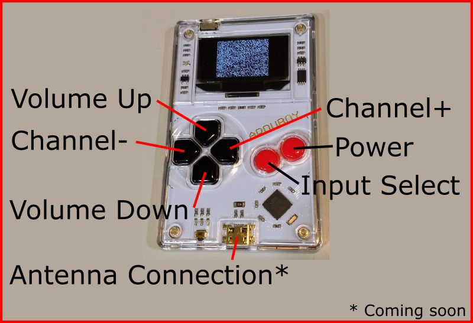

# TVTuner
 Software defined NTSC TV tuner 

## Features
- Software defined demodulation of VHF bands (low and high)
- 4:3 aspect ratio
- Interlace video
- 3 volume settings
- Auxiliary input
- Doesn't work without an antenna 
- US doesn't broadcast analog television anymore
- Antenna doesn't exist ...
